<picture>
  <source media="(prefers-color-scheme: dark)" srcset="assets/header-night.svg">
  
</picture>

  

  
  
  
  

## 🤿 0m · Surface Interval

Hey, I'm Hrishi — a junior at Tulane University double-majoring in **Computer Science and Mathematics** (minors in AI and Business, 3.95 GPA) on a full-tuition **South Asian Scholar** merit award, based in New Orleans. I like building intelligent systems end to end: from the math underneath to the deployed product on top. Pre-dive check complete.

🔎 **Recruiting for Summer 2027 SWE and AI/ML internships.**

## 🧭 Dive Log · Experience

- 🛠️ **[Louisa AI](https://louisa.ai)** — *Software Engineer Intern, Embedded AI team* · relationship-intelligence platform spun out of Goldman Sachs. Building production person-enrichment pipelines: open-web fallback enrichment, confidence-gated LLM identity judging, and trust-tier field reconciliation.
- 🗳️ **Tulane Data & AI Collective (TUDAI)** — *Research Assistant* · co-authored a paper accepted at **[AAMAS 2026](https://www.aamas2026.org)** on optimal positional scoring rules in computational social choice. Currently exploring social-choice methods for retrieval in multi-agent RAG.
- 🧑‍🏫 **Tulane Computer Science** — *Teaching Assistant, CMPS 3160 (Data Science) & CMPS 1500 (Intro CS)* · weekly labs and office hours for 50+ students.
- 🤖 **Niyogin AI** — *AI Intern* · designed and deployed an NLP pipeline for automated document digitization at 97% precision.
- 📊 **ITI Growth Opportunities** — *Intern* · researched and presented GenAI applications across industries.

## 🪸 18m · The Reef

Where the activity is. Six builds I keep coming back to:

### 🏎️ [F1 Rule & Penalty Interpreter](https://github.com/HrishiKabra)
RAG system over 1,000+ FIA regulation and steward-decision PDFs that explains Formula 1 incidents with rule-grounded citations.
- GenAI Ops experiments on chunking, embeddings, and context size lifted citation coverage **60% → 93%**
- *Python · Gradio · LLM APIs · RAG*

### ⚽ [World Cup Prediction Market Engine](https://github.com/HrishiKabra)
Dixon-Coles bivariate Poisson model fit via MLE on 15,494 international matches, priced by an LMSR automated market maker over 100K Monte Carlo tournament simulations.
- **0.572 Brier score** vs. 0.613 Elo baseline on a walk-forward Euro 2024 backtest
- *Python · SciPy · FastAPI · Next.js · DigitalOcean · Vercel*

### 🗳️ [Optimal Voting](https://pypi.org/project/optimal-voting/) — AAMAS 2026
Research framework and Python package for computing optimal positional scoring rules using simulated annealing, gradient descent, and MIP across four social welfare functions.
- Co-authored with Ben Armstrong and Nicholas Mattei · [Live demo](https://ai-innovation.tulane.edu/optimalvoting)
- *Python · Django · MIP*

### 📈 [Cross-Venue Arbitrage Engine](https://github.com/HrishiKabra)
Async prediction-market arbitrage scanner across Kalshi and Polymarket with fuzzy event matching (Jaccard + Levenshtein, >95% accuracy) and fee-adjusted EV execution in under 2s end to end.
- *Python · AsyncIO · SQLite · Docker*

### 🐟 [FishID](https://fishid.vercel.app)
Full-stack web app that identifies fish species from images — Flask REST backend integrating Fishial + Groq AI, JWT/bcrypt auth, split deployment on Vercel and Render.
- *Python · Flask · Next.js · TypeScript · SQLite*

### 🏁 [Circuit DNA](https://hrishikabra.github.io/circuit_dna/)
F1 telemetry fingerprint tool visualizing throttle behavior across circuits using 360° resampled OpenF1 data.
- *Python · OpenF1 API*

## 🔬 30m · The Research Station

- 📄 Co-authored paper accepted at **[AAMAS 2026](https://www.aamas2026.org)** (Conference on Autonomous Agents and Multiagent Systems) on optimal positional scoring rules — with Ben Armstrong and Nicholas Mattei
- 📦 Shipped the research as a PyPI package: [`optimal-voting`](https://pypi.org/project/optimal-voting/) · [live demo](https://ai-innovation.tulane.edu/optimalvoting)
- 🧪 Current direction: social-choice methods for retrieval in multi-agent RAG
- 🎓 Dean's List every semester · full-tuition South Asian Scholar (~$67K/yr) · Corporate Sponsorship Chair, Alpha Kappa Psi

**Instrumentation on board:**

**Languages** — Python · Java · C/C++ · JavaScript · TypeScript · SQL · R · Assembly · Bash
**AI/ML** — PyTorch · RAG · LLM Agents · NLP (SpaCy) · Prompt Engineering · Fine-Tuning · MLOps · Evals
**Full Stack & Infra** — React · Next.js · Flask · Django · FastAPI · AWS (S3, Glue, Athena) · Docker · Git · SQLite

## ⚓ 40m · The Wreck

Older builds, still worth the swim-through:

- 🧭 [Wikipedia Race](https://wikipediarace.netlify.app) — bidirectional BFS pathfinding game across Wikipedia
- 🐋 [Ocean Jukebox](https://github.com/HrishiKabra/ocean_jukebox) — 131 NOAA hydrophone recordings, browsable by ear
- 🌊 [ReefGuardian](https://github.com/HrishiKabra) — serverless AWS pipeline over NOAA sea-surface temperatures, flagging coral-bleaching hotspots
- 🎸 [GigPilot](https://github.com/HrishiKabra) — multi-agent live-music booking marketplace

## 🌑 60m · The Abyss

Live telemetry from the bottom. The two instrument readouts regenerate every night from my actual GitHub activity:

  <picture>
    <source media="(prefers-color-scheme: dark)" srcset="https://raw.githubusercontent.com/HrishiKabra/HrishiKabra/output/dive-computer-dark.svg">
    
  </picture>
  <picture>
    <source media="(prefers-color-scheme: dark)" srcset="https://raw.githubusercontent.com/HrishiKabra/HrishiKabra/output/forecast-dark.svg">
    
  </picture>

<picture>
  <source media="(prefers-color-scheme: dark)" srcset="https://raw.githubusercontent.com/HrishiKabra/HrishiKabra/output/snake-dark.svg">
  
</picture>

<picture>
  <source media="(prefers-color-scheme: dark)" srcset="https://raw.githubusercontent.com/HrishiKabra/HrishiKabra/output/3d/profile-night-rainbow.svg">
  
</picture>

⬇️ descend further — full telemetry

 

  <picture>
    <source media="(prefers-color-scheme: dark)" srcset="https://github-readme-stats.vercel.app/api?username=HrishiKabra&show_icons=true&hide_border=true&include_all_commits=true&count_private=true&bg_color=00000000&title_color=22a3b8&text_color=80deea&icon_color=5ee7df">
    
  </picture>
  <picture>
    <source media="(prefers-color-scheme: dark)" srcset="https://github-readme-stats.vercel.app/api/top-langs/?username=HrishiKabra&layout=compact&hide_border=true&langs_count=8&bg_color=00000000&title_color=22a3b8&text_color=80deea">
    
  </picture>

## 🫧 5m · Safety Stop

Three minutes before surfacing. Off the keyboard I'm a **PADI Master Scuba Diver** and underwater videographer — **80 dives logged**, with Komodo, Indonesia as my favorite site — and I think a lot about where intelligent systems and ocean conservation can meet. Also: Formula 1 weekends, a long-running Wordle streak, and the occasional ruthless Monopoly tournament.

— surfacing · thanks for diving along 🫧 · <a href="mailto:hkabra@tulane.edu">say hi</a> —

