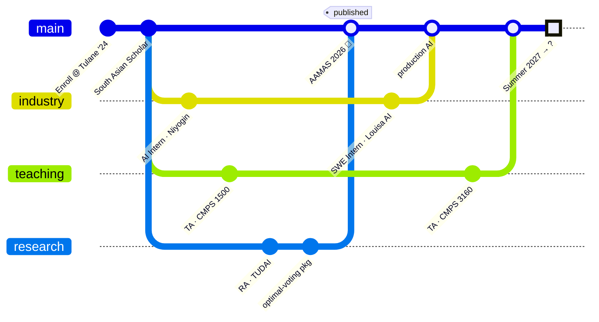

# Dive Log Profile README Implementation Plan

> **For agentic workers:** REQUIRED SUB-SKILL: Use superpowers:subagent-driven-development (recommended) or superpowers:executing-plans to implement this plan task-by-task. Steps use checkbox (`- [ ]`) syntax for tracking.

**Goal:** Build the complete "Dive Log" GitHub profile README — depth-themed markdown, animated header SVGs, two daily-generated instrument cards (Dive Computer + Dive Forecast), and the supporting GitHub Actions — per the approved spec.

**Architecture:** Static assets (header, wave dividers) are hand-authored SVGs in `assets/`. Dynamic cards are rendered daily by two Python scripts sharing a common card template module; a single workflow runs them and publishes SVGs + forecast history to the `output` branch (same pattern as the existing snake), so `main` never receives daily commits. Pure logic (probabilities, Brier, streaks, SVG layout) is separated from API fetching so it is unit-testable offline.

**Tech Stack:** Python 3.11 (stdlib + `requests`), GitHub REST + GraphQL APIs, GitHub Actions, hand-written SVG with CSS animations, Mermaid (native GitHub rendering), pytest.

**Spec:** `docs/superpowers/specs/2026-06-12-dive-log-readme-design.md`

## Palettes (single source of truth — used in every asset and in `scripts/card_common.py`)

| Token | Day (light) | Night (dark) |
|---|---|---|
| depth0 | `#e0f7fa` | `#0d2137` |
| depth1 | `#80deea` | `#14455c` |
| depth2 | `#26c6da` | `#1b6e85` |
| depth3 | `#0097a7` | `#22a3b8` |
| depth4 | `#006064` | `#5ee7df` |
| abyss  | `#041c26` | `#020d13` |
| accent | `#ff6d00` | `#ff8a50` |
| text   | `#063a44` | `#d8f6ff` |

## File structure

```
README.md                          # rewritten, depth-structured
assets/
  header-day.svg                   # animated surface scene (light)
  header-night.svg                 # night-dive variant (dark)
  wave-1.svg … wave-5.svg          # section dividers, darkening fills
scripts/
  card_common.py                   # palette dicts + SVG primitives (card frame, bar, text row)
  dive_computer.py                 # fetch GitHub data → dive-computer.svg / -dark.svg
  forecast.py                      # probabilities + history resolution + Brier → forecast.svg / -dark.svg
tests/
  test_card_common.py
  test_dive_computer.py
  test_forecast.py
.github/workflows/
  snake.yml                        # existing eel workflow (verbatim from draft)
  daily-cards.yml                  # daily: run both scripts, publish dist/ → output branch
  3d-contrib.yml                   # 3D contribution terrain, ocean colors
  metrics.yml                      # lowlighter/metrics isocalendar + languages
docs/FORECAST.md                   # methodology footnote target
```

---

### Task 1: Wave dividers

**Files:** Create `assets/wave-1.svg` … `assets/wave-5.svg`

- [ ] **Step 1:** Author five divider SVGs, 1200×40, `preserveAspectRatio="none"`, each a double-wave path. Fill colors step down: wave-1 `#80deea`, wave-2 `#26c6da`, wave-3 `#0097a7`, wave-4 `#006064`, wave-5 `#041c26`. Use `currentColor`-free plain fills (GitHub strips external CSS) with 35% opacity back wave + full-opacity front wave:

```svg
<svg xmlns="http://www.w3.org/2000/svg" viewBox="0 0 1200 40" preserveAspectRatio="none" width="100%" height="40">
  <path d="M0,22 C150,38 300,6 450,20 C600,34 750,8 900,22 C1050,36 1150,14 1200,20 L1200,40 L0,40 Z" fill="#80deea" opacity="0.35"/>
  <path d="M0,28 C200,12 400,40 600,26 C800,12 1000,38 1200,24 L1200,40 L0,40 Z" fill="#80deea"/>
</svg>
```

(repeat with each fill color; vary phase by shifting control points so adjacent dividers don't look copy-pasted)

- [ ] **Step 2:** Open each in browser to verify rendering. Commit: `git commit -m "feat: add wave section dividers"`

### Task 2: Skeleton README

**Files:** Rewrite `README.md`

- [ ] **Step 1:** Write the full README with all final prose content (sourced from the user's draft), structured per spec section table. Key mechanical elements:

Header block (assets referenced ahead of Task 3 — acceptable, repo renders them once pushed together):

```html
<picture>
  <source media="(prefers-color-scheme: dark)" srcset="assets/header-night.svg">
  
</picture>
<p align="center">
  
</p>
```

Dive Plan mermaid (exact):



Section headers use depth markers, e.g. `## 🤿 0m · Surface Interval`, `## 🪸 18m · The Reef`, `## 🔬 30m · The Research Station`, `## ⚓ 40m · The Wreck`, `## 🌑 60m · The Abyss`, `## 🫧 5m · Safety Stop`. Dividers between sections: ``.

The Abyss embeds (output-branch URLs, will 404 until workflows run — expected):

```html
<picture>
  <source media="(prefers-color-scheme: dark)" srcset="https://raw.githubusercontent.com/HrishiKabra/HrishiKabra/output/dive-computer-dark.svg">
  
</picture>
```

(same pattern for `forecast.svg`, snake, `3d-contrib.svg`, `metrics.svg`)

Stats cards keep custom hex params: `&bg_color=00000000&title_color=0097a7&text_color=006064&icon_color=26c6da&hide_border=true`.

- [ ] **Step 2:** Preview rendering (e.g. `grip` or push to a test gist) — verify mermaid renders and structure reads as a dive. Commit: `git commit -m "feat: rewrite README with dive-log structure"`

### Task 3: Animated header (day + night)

**Files:** Create `assets/header-day.svg`, `assets/header-night.svg`

- [ ] **Step 1:** Author `header-day.svg`, 1200×320, all animation via embedded `<style>` CSS keyframes (survives camo proxy; no external refs, no scripts):
  - Sky band (0–110px) gradient `#fff7e6→#e0f7fa`, sun glow circle top-right
  - Waterline at y=110 with gentle `translateX` oscillating wave path (8s loop)
  - Water body gradient `#80deea→#006064→#041c26`
  - `HRISHI KABRA` in bold sans at the waterline: top half plain `#063a44`, bottom half a clipped duplicate, `opacity 0.5`, skewed −4° (refraction), color `#e0f7fa`
  - Subtitle line `SWE · AI research · master scuba diver` below in `#0097a7`
  - 3 bubble groups (`<g>` of 4–6 circles, r 2–5) rising with `translateY(-340px)` keyframes at 9s/13s/17s, staggered `animation-delay`, fading opacity
  - Manta silhouette: single `<path>` filled `#063a44` opacity 0.55, crossing right→left at y≈210 over 45s linear loop with slight sinusoidal bob
  - Light rays: 3 skewed translucent white polygons from waterline, opacity pulsing 10s
- [ ] **Step 2:** Author `header-night.svg`: same geometry; sky `#020d13` with tiny star dots, water `#0d2137→#020d13`, name top-half `#d8f6ff`, bubbles glow `#5ee7df` (opacity 0.8), manta `#000a10` opacity 0.7, light rays replaced by a cone-shaped dive-light beam (translucent `#5ee7df` polygon) sweeping ±8° (12s)
- [ ] **Step 3:** Open both in a browser; verify all animations loop seamlessly and text is legible. Commit: `git commit -m "feat: add animated day/night header"`

### Task 4: `card_common.py` (TDD)

**Files:** Create `scripts/card_common.py`, `tests/test_card_common.py`

- [ ] **Step 1:** Write failing tests:

```python
from scripts.card_common import PALETTES, esc, bar, card

def test_palettes_have_required_tokens():
    for mode in ("day", "night"):
        for token in ("depth0","depth2","depth4","abyss","accent","text","bg"):
            assert PALETTES[mode][token].startswith("#")

def test_esc_escapes_xml():
    assert esc("<&>") == "&lt;&amp;&gt;"

def test_bar_width_proportional():
    svg = bar(x=10, y=0, w=200, frac=0.5, palette=PALETTES["day"])
    assert 'width="100"' in svg

def test_bar_clamps_frac():
    assert 'width="200"' in bar(x=0, y=0, w=200, frac=1.7, palette=PALETTES["day"])

def test_card_wraps_rows_in_svg():
    out = card(title="DIVE COMPUTER", rows_svg="<g/>", palette=PALETTES["day"], width=420, height=240)
    assert out.startswith("<svg") and "DIVE COMPUTER" in out and out.rstrip().endswith("</svg>")
```

- [ ] **Step 2:** Run `python -m pytest tests/test_card_common.py -v` — expect FAIL (module missing)
- [ ] **Step 3:** Implement `card_common.py`: `PALETTES` per the palette table (plus `bg`: day `#f4fdff`, night `#071a24`), `esc()` via `xml.sax.saxutils.escape`, `bar()` returning a rounded-rect track + accent fill rect, `card()` returning the instrument frame — rounded rect, bezel stroke `depth3`, title in monospace small-caps style (`font-family="ui-monospace,Menlo,monospace"` `letter-spacing="3"`), a thin accent underline, rows injected, footer baseline. Pure functions, no I/O.
- [ ] **Step 4:** Run tests — expect PASS
- [ ] **Step 5:** Commit: `git commit -m "feat: shared SVG card template"`

### Task 5: Dive Computer card (TDD)

**Files:** Create `scripts/dive_computer.py`, `tests/test_dive_computer.py`

API budget (≤5 requests): GraphQL `contributionsCollection.contributionCalendar` (streak, year total, weekend stats); REST `GET /users/{u}/repos?sort=pushed&per_page=100` (gas mix from primary `language` of non-fork repos); REST `GET /search/issues?q=author:{u}+type:pr+state:open` (deco stop); REST `GET /users/{u}/events?per_page=100` (commit counts/timestamps — shared with forecast).

- [ ] **Step 1:** Write failing tests for pure logic (fetch is a thin separate function, not unit-tested):

```python
from scripts.dive_computer import current_streak, gas_mix, render

def test_current_streak_counts_back_from_today():
    days = {"2026-06-12": 3, "2026-06-11": 1, "2026-06-10": 0, "2026-06-09": 5}
    assert current_streak(days, today="2026-06-12") == 2

def test_current_streak_allows_empty_today():
    days = {"2026-06-12": 0, "2026-06-11": 2, "2026-06-10": 1}
    assert current_streak(days, today="2026-06-12") == 2

def test_gas_mix_top3_with_o2_remainder():
    langs = ["Python"]*7 + ["TypeScript"]*2 + ["R"]*1
    assert gas_mix(langs) == "PY 70 / TS 20 / O₂ 10"

def test_render_contains_metrics():
    svg = render(mode="day", bottom_time=42, ndl=7, mix="PY 70 / TS 20 / O₂ 10", max_depth=812, deco=2)
    assert "42" in svg and "BOTTOM TIME" in svg and svg.startswith("<svg")
```

- [ ] **Step 2:** Run `python -m pytest tests/test_dive_computer.py -v` — expect FAIL
- [ ] **Step 3:** Implement: `current_streak(days: dict[str,int], today: str)` walks back from today (today itself may be 0 without breaking the streak); `gas_mix(langs)` maps language→abbrev (`Python→PY, TypeScript→TS, JavaScript→JS, Java→JV, C++→C++, Jupyter Notebook→NB, HTML→HT, R→R`, default first 2 letters upper), top 2 by share + remainder labeled `O₂`; `render(...)` builds five labeled readout rows via `card_common` (value in large accent monospace, label small) and returns full SVG; `fetch(token, user)` does the four API calls and returns a plain dict; `main()` writes `dist/dive-computer.svg` and `dist/dive-computer-dark.svg`, exits 1 on any fetch error (fail-safe per spec)
- [ ] **Step 4:** Run tests — expect PASS
- [ ] **Step 5:** Commit: `git commit -m "feat: dive computer card generator"`

### Task 6: Dive Forecast card (TDD)

**Files:** Create `scripts/forecast.py`, `tests/test_forecast.py`, `markets-history.json` seed (`{"forecasts": []}` — lives on output branch thereafter)

History entry shape: `{"id": "python-commit:2026-06-12", "market": "python-commit", "date": "2026-06-12", "horizon": "2026-06-13", "p": 0.81, "outcome": null}`. Markets: `python-commit` (resolves next day: any push event that day whose repo primary language is Python), `new-repo-month` (resolves at month end: any repo with `created_at` in month), `night-dive-week` (resolves end of ISO week: any push event 00:00–05:00 America/Chicago), `weekend-streak` (resolves Monday: contributions on both Sat and Sun).

- [ ] **Step 1:** Write failing tests:

```python
from scripts.forecast import laplace, brier, resolve_due, todays_forecasts

def test_laplace_smoothing():
    assert laplace(hits=8, n=10) == (8+1)/(10+2)
    assert laplace(hits=0, n=0) == 0.5

def test_brier_mean_squared_error():
    hist = [{"p":0.8,"outcome":True},{"p":0.3,"outcome":False},{"p":0.5,"outcome":None}]
    assert abs(brier(hist) - ((0.2**2 + 0.3**2)/2)) < 1e-9

def test_brier_none_when_nothing_resolved():
    assert brier([{"p":0.5,"outcome":None}]) is None

def test_resolve_due_only_past_horizon():
    hist = [{"id":"a","market":"python-commit","horizon":"2026-06-10","p":0.8,"outcome":None},
            {"id":"b","market":"python-commit","horizon":"2026-06-13","p":0.7,"outcome":None}]
    out = resolve_due(hist, today="2026-06-12", resolver=lambda e: True)
    assert out[0]["outcome"] is True and out[1]["outcome"] is None

def test_todays_forecasts_skips_existing_ids():
    existing = [{"id":"python-commit:2026-06-12"}]
    new = todays_forecasts({"python-commit":0.8,"new-repo-month":0.6}, today="2026-06-12", existing=existing)
    assert [e["market"] for e in new] == ["new-repo-month"]
```

- [ ] **Step 2:** Run `python -m pytest tests/test_forecast.py -v` — expect FAIL
- [ ] **Step 3:** Implement pure layer (`laplace`, `brier`, `resolve_due`, `todays_forecasts`, per-market probability functions from events/repos/calendar data), resolvers (each market's outcome from fetched data; entries older than 80 days with no data resolve to `None`-forever and are excluded from Brier), `render()` — forecast rows as label + `bar()` + percentage, footer `calibration (Brier): 0.19 · n=42 resolved · methodology ↗` linking `docs/FORECAST.md` — and `main()`: load history (path from `$HISTORY_PATH`, default `markets-history.json`), resolve, append, compute Brier, write `dist/forecast.svg`, `dist/forecast-dark.svg`, `dist/markets-history.json`; exit 1 on fetch error
- [ ] **Step 4:** Run tests — expect PASS
- [ ] **Step 5:** Write `docs/FORECAST.md` (4 markets, frequency estimation, Laplace smoothing, resolution rules, Brier definition)
- [ ] **Step 6:** Commit: `git commit -m "feat: dive forecast card with Brier-scored history"`

### Task 7: Workflows

**Files:** Create `.github/workflows/snake.yml` (verbatim from the user's existing draft), `.github/workflows/daily-cards.yml`, `.github/workflows/3d-contrib.yml`, `.github/workflows/metrics.yml`

- [ ] **Step 1:** `daily-cards.yml`:

```yaml
name: Generate dive instrument cards
on:
  schedule: [{cron: "30 6 * * *"}]   # 06:30 UTC ≈ 1:30am New Orleans
  workflow_dispatch:
permissions: {contents: write}
jobs:
  cards:
    runs-on: ubuntu-latest
    timeout-minutes: 10
    steps:
      - uses: actions/checkout@v4
      - uses: actions/setup-python@v5
        with: {python-version: "3.12"}
      - run: pip install requests
      - name: Pull current forecast history from output branch
        run: |
          mkdir -p dist
          curl -sf https://raw.githubusercontent.com/HrishiKabra/HrishiKabra/output/markets-history.json \
            -o markets-history.json || echo '{"forecasts": []}' > markets-history.json
      - run: python scripts/dive_computer.py
        env: {GITHUB_TOKEN: "${{ secrets.GITHUB_TOKEN }}", GH_USER: HrishiKabra}
      - run: python scripts/forecast.py
        env: {GITHUB_TOKEN: "${{ secrets.GITHUB_TOKEN }}", GH_USER: HrishiKabra}
      - name: Publish to output branch
        uses: crazy-max/ghaction-github-pages@v4
        with: {target_branch: output, build_dir: dist, keep_history: true}
        env: {GITHUB_TOKEN: "${{ secrets.GITHUB_TOKEN }}"}
```

(`keep_history: true` so snake SVGs on `output` are not wiped — verify snake job's action behaves likewise; if the snake action force-pushes, switch both to a shared `dist` layout or distinct target dirs)

- [ ] **Step 2:** `3d-contrib.yml`: `yoshi389111/github-profile-3d-contrib@0.7.1` daily, `SETTING_JSON` ocean colors matching palette, output to `dist/3d/` → publish to `output` with `keep_history: true`
- [ ] **Step 3:** `metrics.yml`: `lowlighter/metrics@latest`, plugins `isocalendar` (full-year) + `languages`, `config_output: svg`, custom ocean base colors, `output_action: commit` to `output` branch as `metrics.svg`
- [ ] **Step 4:** Validate all YAML (`python -c "import yaml,glob; [yaml.safe_load(open(f)) for f in glob.glob('.github/workflows/*.yml')]"`). Commit: `git commit -m "feat: daily card, 3d-contrib, metrics workflows"`

### Task 8: Local smoke test + final pass

- [ ] **Step 1:** Run `GITHUB_TOKEN=$(gh auth token) GH_USER=HrishiKabra python scripts/dive_computer.py && python scripts/forecast.py` (same env) — verify `dist/*.svg` generate without error (if no local token available, mock with a recorded fixture and note that live verification happens on first Actions run)
- [ ] **Step 2:** Open all four generated SVGs + header + dividers in browser; check legibility, alignment, day/night palettes
- [ ] **Step 3:** Full-README visual pass in light and dark; fix palette inconsistencies
- [ ] **Step 4:** Run full test suite `python -m pytest -v` — expect all PASS
- [ ] **Step 5:** Commit: `git commit -m "polish: final dive-log palette and layout pass"`

### Task 9: Hand-off notes

- [ ] **Step 1:** Write `docs/DEPLOY.md`: push contents to `HrishiKabra/HrishiKabra` main branch; run each workflow once from Actions tab (`workflow_dispatch`); confirm `output` branch contains `snake.svg`, `dive-computer.svg`, `forecast.svg`, `3d/`, `metrics.svg`; README images go live. Commit: `git commit -m "docs: deployment instructions"`
